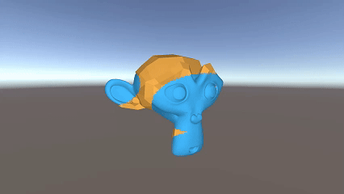

# `SV_StencilRef`的应用

作为一个本身就不是很喜欢用Stencil Buffer的人，我第一次看到`SV_StencilRef`这个特性的时候实在想不出有啥可以用的地方。不过前几天想玩法时，总算是想到了一个可以勉强用一用的地方。

我们考虑如下图所示的两个Blender的猴头：

可以看到两个猴头存在重叠：任何一个都无法完全“包围”另一个。现在我们把猴头当作角色的衣服，当角色进入不同状态时，我们期望角色的衣服也能同步的发生变化(变为另一套)，并且其变化过程是类似于“溶解”的(或反过来的)。

很显然，如果我们用自定义的mask来做这个效果，并要做到“形态”变化的过程中不会存在模型“错误”穿透的情况，是需要额外的draw call的。不过用`SV_StencilRef`来做就不需要额外的draw call了。

我们只需要先利用一个能同时包围两个目标网格的网格，在ps中向`SV_StencilRef`写入目标的两个reference值，然后再绘制两个目标网格即可。效果如下：

但是(反转来了啊)，demo这种对动态的分镜(推、拉、移等等)支持的很差，如果需要动态的分镜下仍然有不错的效果，可能需要更合适的mask用的网格(未验证，demo里就是一个球)。

当然，以上的都不是重点，真正让`SV_StencilRef`成为小众变态特性的是：

- 这是一个dx11.3(也就是shader model5.1)才支持的特性，而unity的dx11只支持到shader model 5.0，因此想要用的话就必须用dx12(或者自己扩展咯)，此外[opengl是不支持在ps里直接写入值的](https://registry.khronos.org/OpenGL/extensions/ARB/ARB_shader_stencil_export.txt)(vulkan我不确定, ~~metal who cares~~)。

- 需要显卡对其支持：没错，这特性I卡A卡支持，N卡不支持！详见[[1]](https://forums.unrealengine.com/t/has-ue4-supported-sv-stencilref-yet/502172)[[2]](https://forum.beyond3d.com/threads/unreal-engine-5-ue5-developer-availability-2022-04-05.61740/post-2336919)

  

  ~~这下不得不买AMD了(毕竟是实现了渲染界宇称不守恒的厂)~~

# Reference

[[1]Has UE4 supported SV_StencilRef yet? - Development / Rendering - Epic Developer Community Forums](https://forums.unrealengine.com/t/has-ue4-supported-sv-stencilref-yet/502172)

[[2]This doesn't really matter anymore since UE5 is moving to compute materials but some HW (particularly Nvidia) can't support the SV_StencilRef extension because they don't have independent depth/stencil planes](https://forum.beyond3d.com/threads/unreal-engine-5-ue5-developer-availability-2022-04-05.61740/post-2336919)